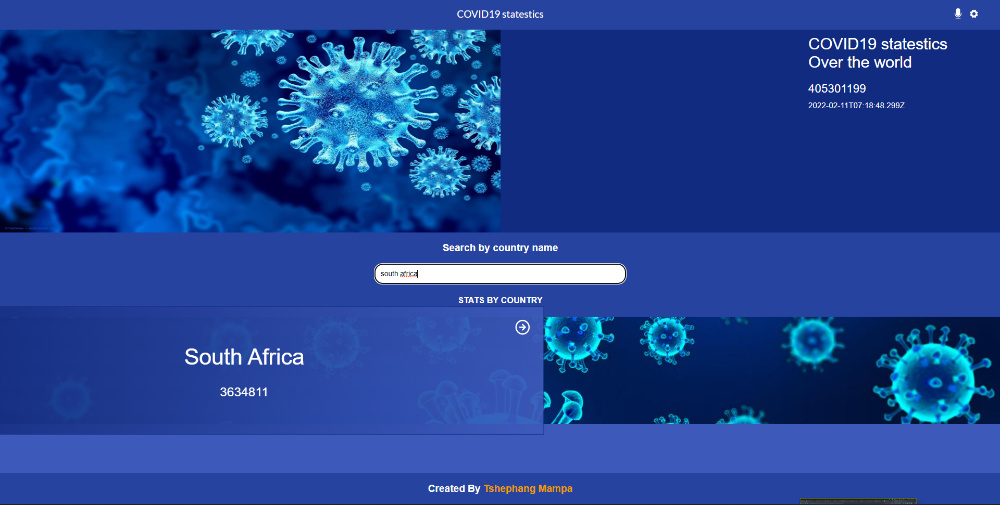

# Covi-Track
> Covi-Track is a web application that fectches covid data from API and renders on the screen. It shows all countries with the confirmed covid cases on the homepage, Users can select any country and goto the details page. Details page shows other details for that specific country like recovered cases, confirmed cases, deaths.

<h2>Home Page<h2>


<h2>Details Page<h2>


<h2>Search<h2>



## 🏗️ Built With

- CSS
- JavaScript
- React JS
- JSX
- [Narrativa API](https://covid19tracking.narrativa.com/index_en.html)

## 🖇️ LiveLink

- [Heroku App]()
- [Netlify App](https://agitated-rosalind-9729ed.netlify.app/)

## 🛫 Getting Started

To get a local copy up and running, follow the steps in Setup below.

### Prerequisites

Basic knowledge of HTML, CSS, and JavaScript.

### Setup

If you installed git you can clone the code to your machine, or download a ZIP of all the files directly.
[Download the ZIP from this location](https://github.com/tmampa/covi-track), or run the following [git](https://github.com/tmampa/covi-track.git) command to clone the files to your machine:

```bash
git clone https://github.com/tmampa/covi-track.git
```

- Once the files are on your machine, open the _Leaderboard_ folder in [Visual Studio Code](https://code.visualstudio.com/), and follow the steps in Installation & Set Up

## 🛠 Installation & Set Up

1. Install Node Modules

   ```sh
   npm install
   ```

2. Start the development server

   ```sh
   npm start
   ```

3. Open [http://localhost:8080](http://localhost:8080) to view it in the browser.

## 🚀 Building and Running for Production

1. Generate a full static production build

   ```sh
   npm run build
   ```

## 🧪 Running Tests with Jest

1. Start the development server

   ```sh
   npm run test
   ```

### 💉 Install

The following tools help make easier to work with sample code.

- [git](https://git-scm.com/downloads): A tool for managing source code
- [Visual Studio Code](https://code.visualstudio.com/): A source code editor
- [NVM](https://github.com/nvm-sh/nvm)

## 👨🏾‍💻 Author

👤 **Tshephang Mampa**

- GitHub: [tmampa](https://github.com/tmampa)
- LinkedIn: [Tshephang Mampa](https://linkedin.com/tshephangmampa)
- Twitter: [Tshephangm\_](https://twitter.com/tshephangm_)

## 🤝 Contributing

Contributions, issues, and feature requests are welcome!

## ❤️ Show your support

Give a ⭐️ if you like this project!

## Acknowledgments

- Thank you for Microverse for providing the required materials

## 📝 License
